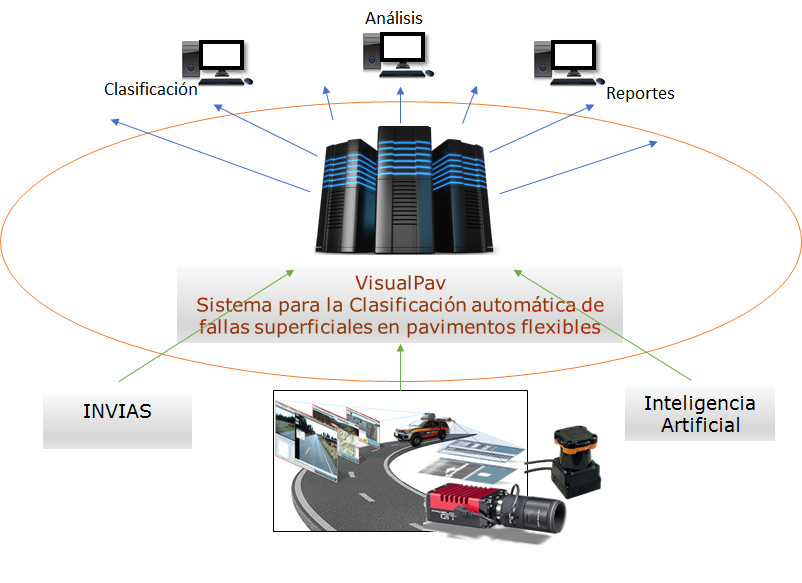
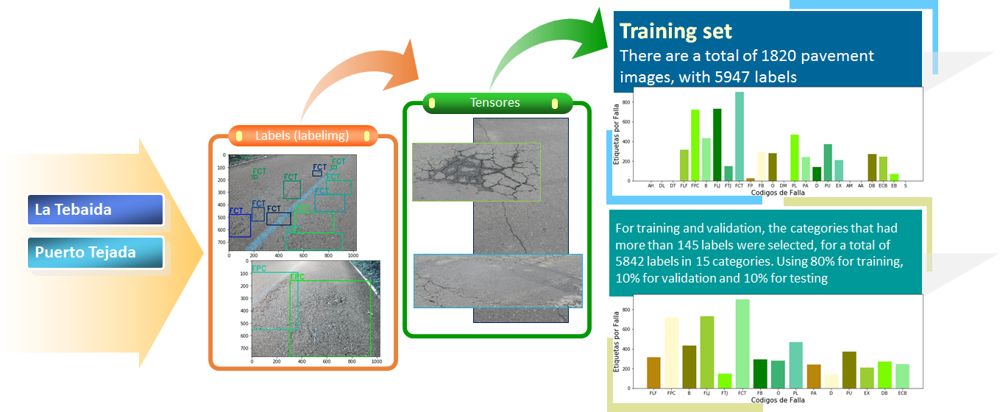
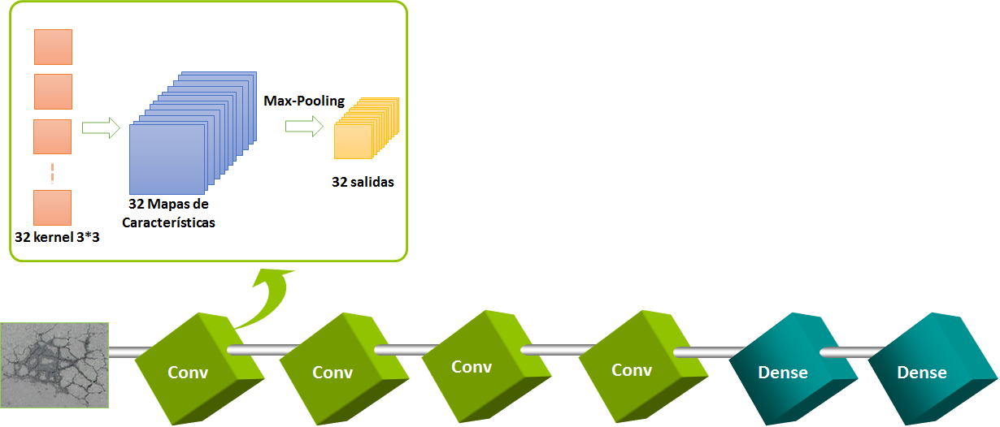

# Java Visual Pavement

### Pavement Distress Detection and Classification

This project is an adaptation of the original [VisualPavement repository](https://github.com/ximenarios/VisualPavement), featuring an interesting replication of a deep learning model originally developed in Python, now built and executed entirely in Java.

To maintain road infrastructure in good condition, periodic evaluations are needed to determine its status and plan appropriate intervention actions[cite: 6]. The objective of this project is to propose a software tool for the automatic classification of surface faults in flexible pavements[cite: 6]. 

The classification of the deteriorations is carried out in accordance with what is established in Colombia by the National Road Institute (INVIAS)[cite: 6].



## Dataset

* The original images were provided by a consulting company and taken on two roads in Colombia (La Tebaida, Puerto Tejada)[cite: 6].
* For training and validation, the categories that had more than 145 labels were selected, for a total of 15 categories[cite: 6].
* The classes include failures such as Alligator Cracking (FPC), Fatigue Cracking (FLF), Patching (B), among others[cite: 3, 6].
* The dataset loader reads the images from the local dataset directory and automatically resizes them to a uniform scale of 224x224 pixels with 3 color channels[cite: 2].
* Classification labels are extracted automatically based on the folder names[cite: 2].



## Convolutional Neural Network Architecture

This project replicates the structure of the original Python model using Deeplearning4j[cite: 5]. The model is built from scratch and relies on the stochastic gradient descent optimization algorithm with an RMSProp updater[cite: 5].

The architecture consists of:
* **Four Convolutional Blocks:** Each block contains a `ConvolutionLayer` with a ReLU activation function, immediately followed by a `SubsamplingLayer` (Max-Pooling) to extract features[cite: 5].
* **Dense Layer:** A flattening phase connects to a densely connected layer of 512 outputs with a ReLU activation[cite: 5].
* **Output Layer (Classifier):** A final softmax output layer classifies the image into one of the 15 output categories using the MCXENT loss function[cite: 5].



## Project Structure

The Java application is divided into specific components to handle the machine learning pipeline:

* **`ImageDatasetLoader.java`:** Responsible for loading and preprocessing the pavement images[cite: 2]. It randomizes the order of the images using `FileSplit` for better training results[cite: 2].
* **`VisualPavementModel.java`:** Defines the multi-layer neural network architecture and its hyperparameters[cite: 5].
* **`Main.java`:** The main entry point that coordinates data loading, model building, and training[cite: 4]. It normalizes the images, trains the network over the configured epochs, evaluates performance on testing data, and saves the trained model to disk as a `.zip` file[cite: 4].
* **`Inferencia.java`:** A class dedicated exclusively to prediction[cite: 3]. It restores the pre-trained model and analyzes a single pavement image, returning the detected distress type and the AI confidence level[cite: 3].

## 🚀 How to Run (Docker)

This project is fully containerized. You only need Docker installed on your system to compile and execute the application.

### 1. Build the Image
To compile the Java source code and download all Maven dependencies, run the following command in your terminal:
```bash
docker build --no-cache -t java-visual-pavement .

## Requirements
- Docker Desktop
- Java 17 / Maven